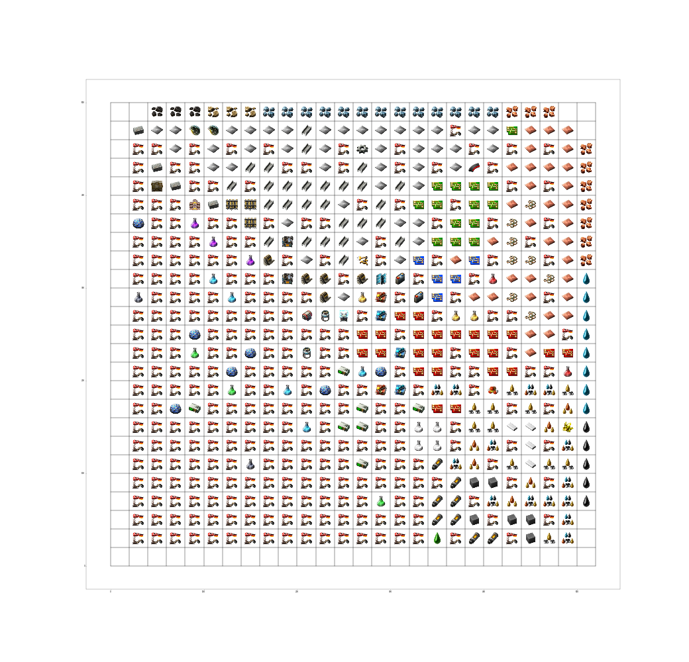
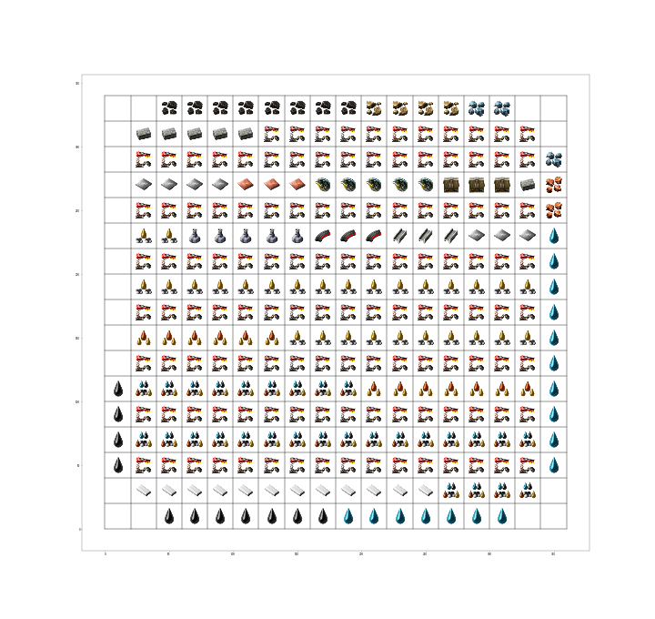
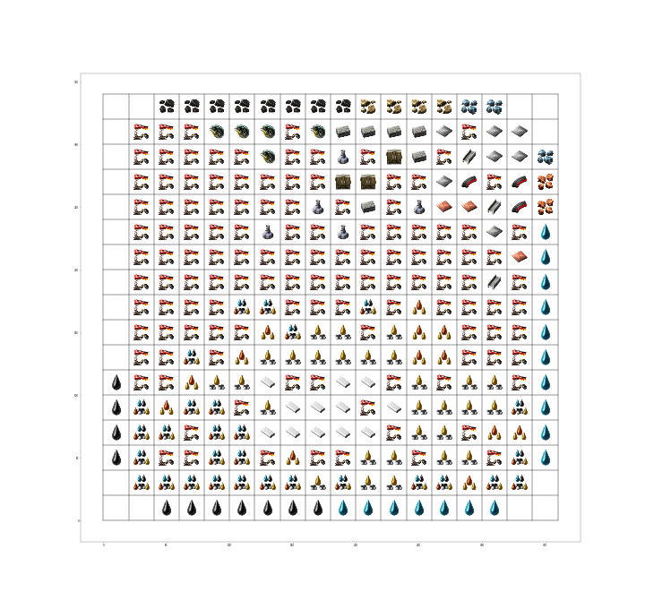
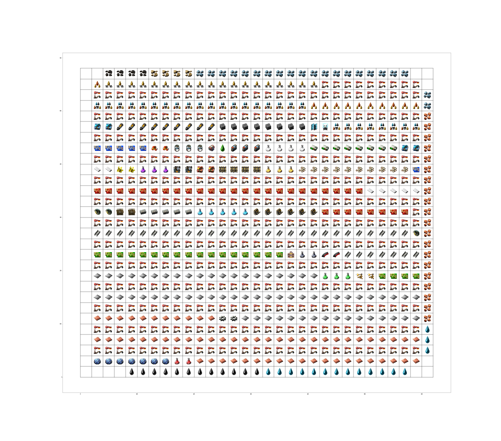
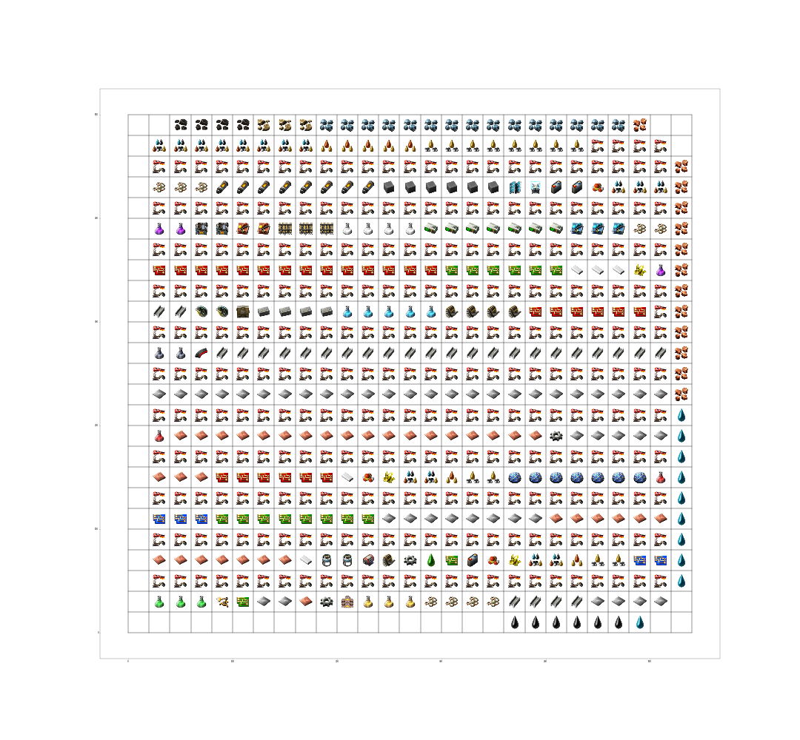
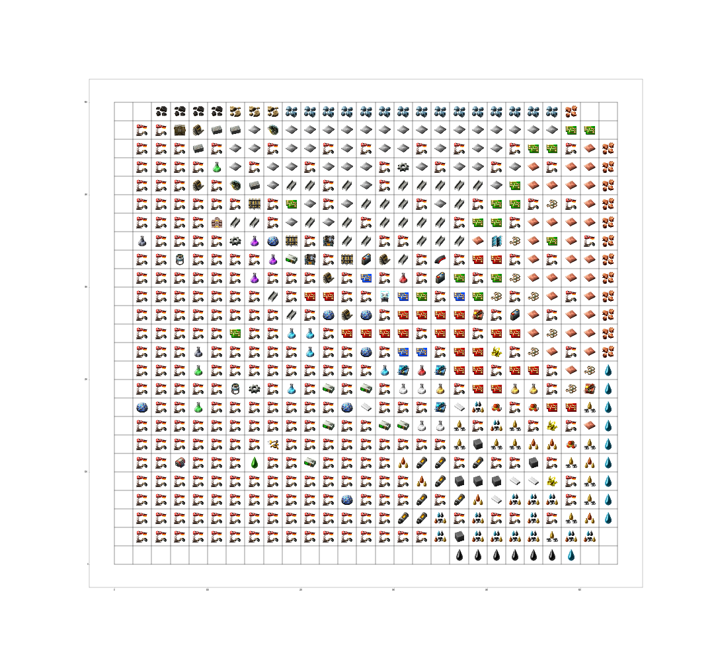
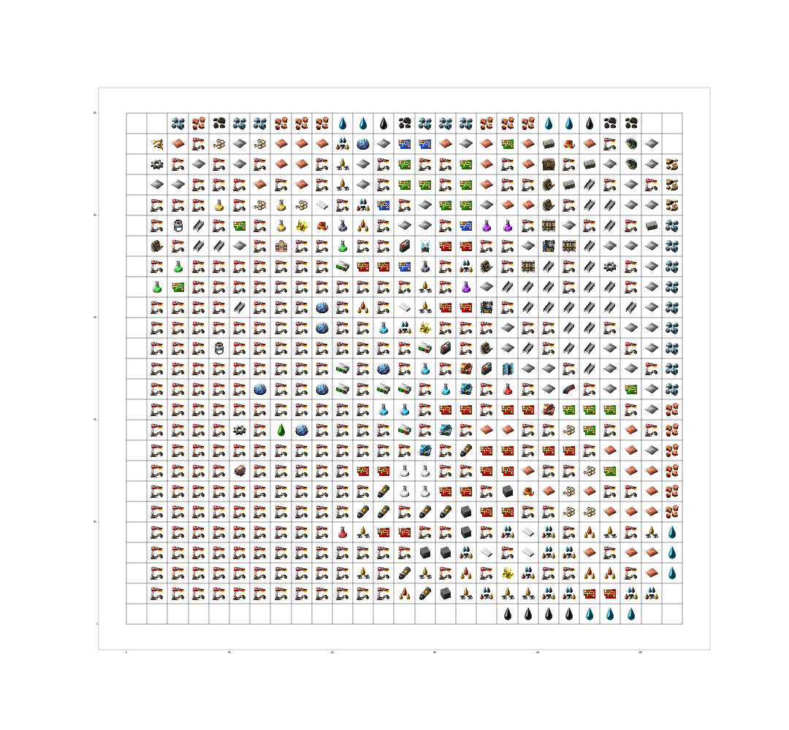
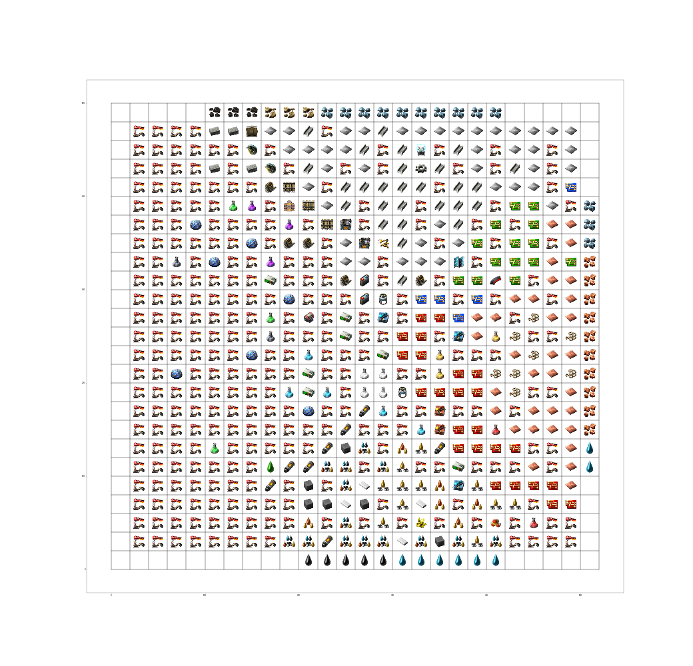
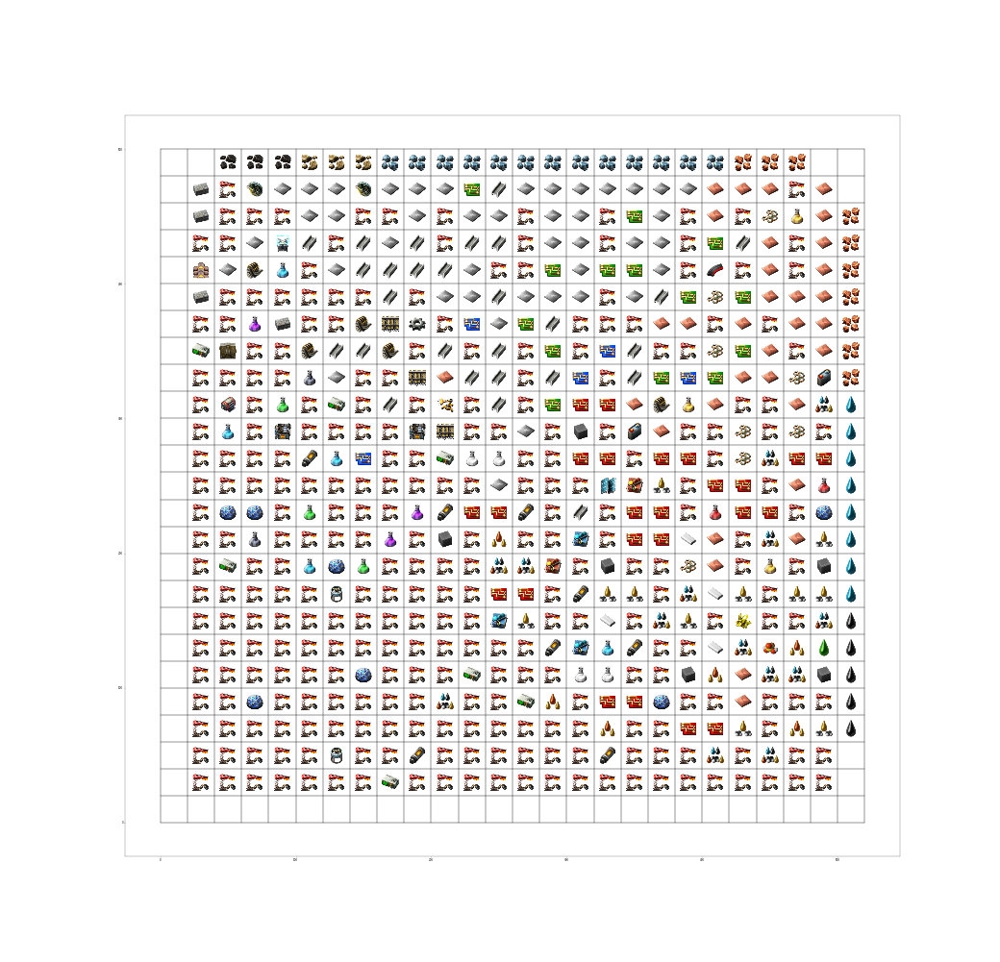

# Factory and Annealer Options
  This section will cover some of the effects of different factory and annealer options described in the main README.  

## Before and after with default settings

  
   

## Different top level items 
  New top level items are 50k plastic bar/min and 2.5k military science/min

  
   

## Lower productivity bonus
  Compare productivity module 3s (left) to productivity module 1s (right)

  
   

## Added partitions
  Compare initial layout of base settings (left) and 3 added partitions: logistic science pack, utility science pack and processing units (right).  Notice it is slightly larger since there is some granularity to the cells.  For example, the logistic science pack partition requires a electronic circuit cell, but doesn't need the full output of the cell (~1 BB).  This can also be seen in the number of coal pins.  

  
   

## Partitioned pins
  Compare the optimized layout of the partitioning above (left) and post optimization with partitioned pins (right).  Notice that the partitions are not well defined with global pins.  The factory cells of the individual partitions are lost in the sea of other cells.  The partitions can be seen quite well in the partitioned pins version.

  
   

## Aspect ratio of 3

## Different pin padding

## Function tolerance change
  Compare the base settings optimized layout (ftol=0.5, left) and the layout of with a function tolerance of 5 (right).  Notice how much more optimized the layout with lower tolerance.  

  
   

## Multiple settings example
  The following layout modifies multiple settings, including partitioned pins, pin padding and all sciences have separate partitions.

